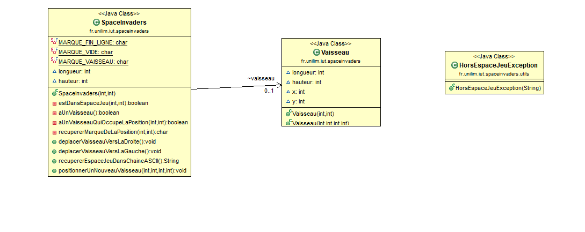
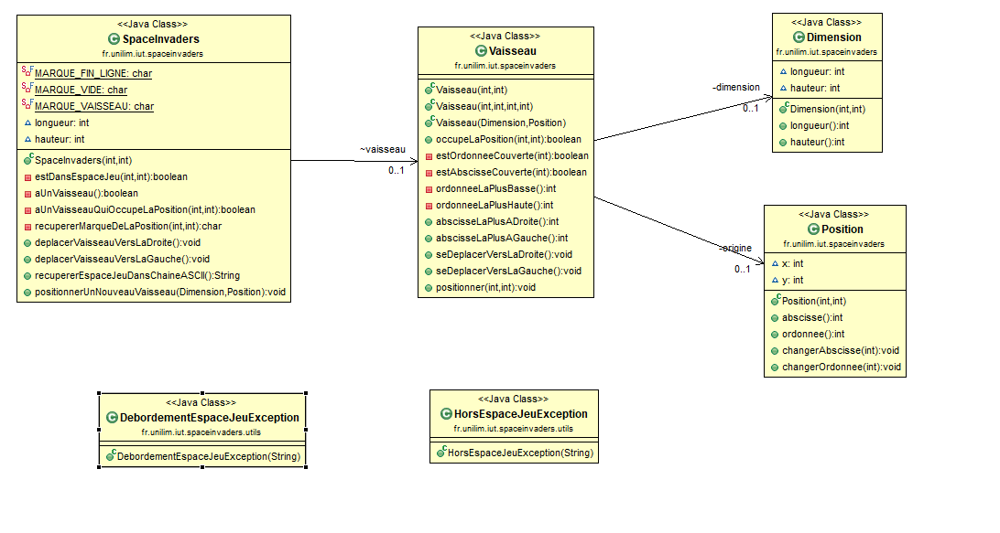
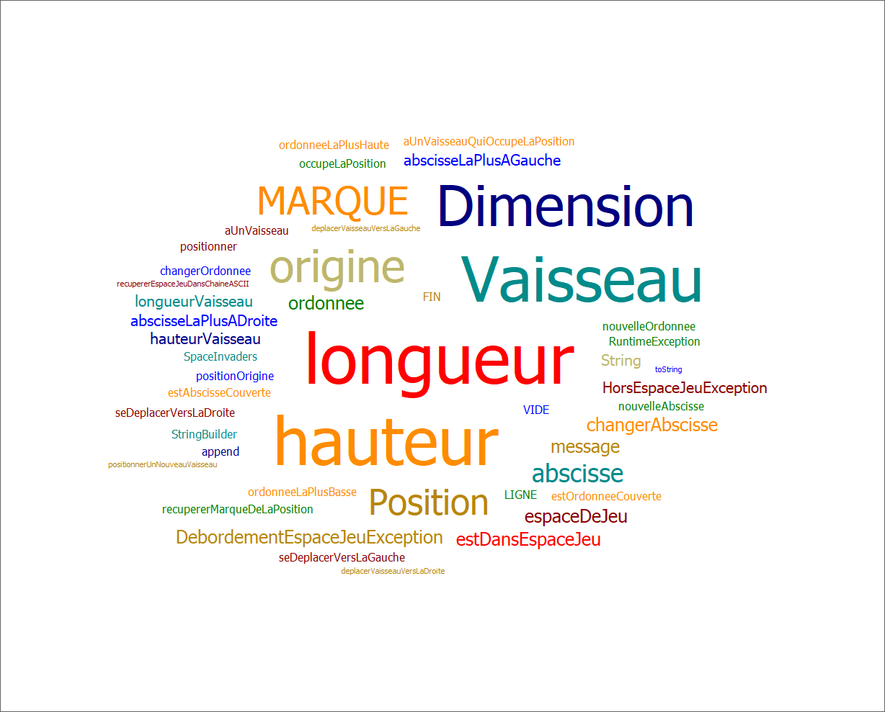
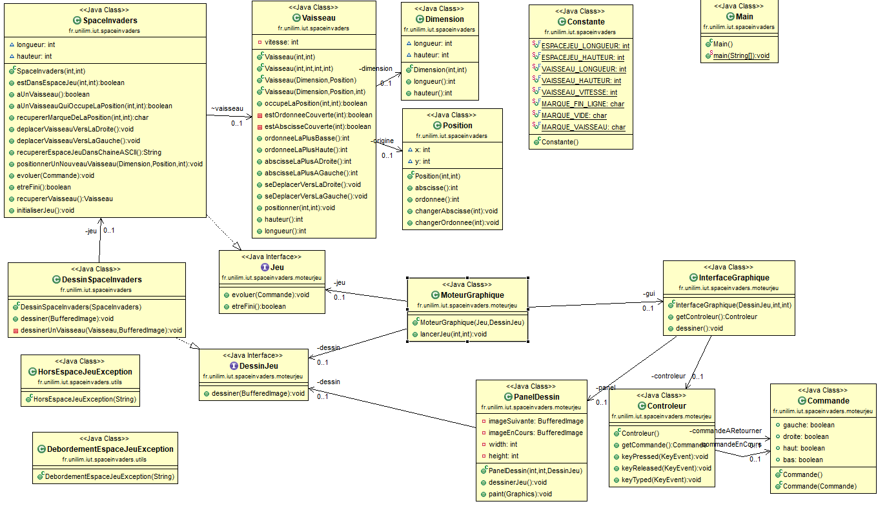
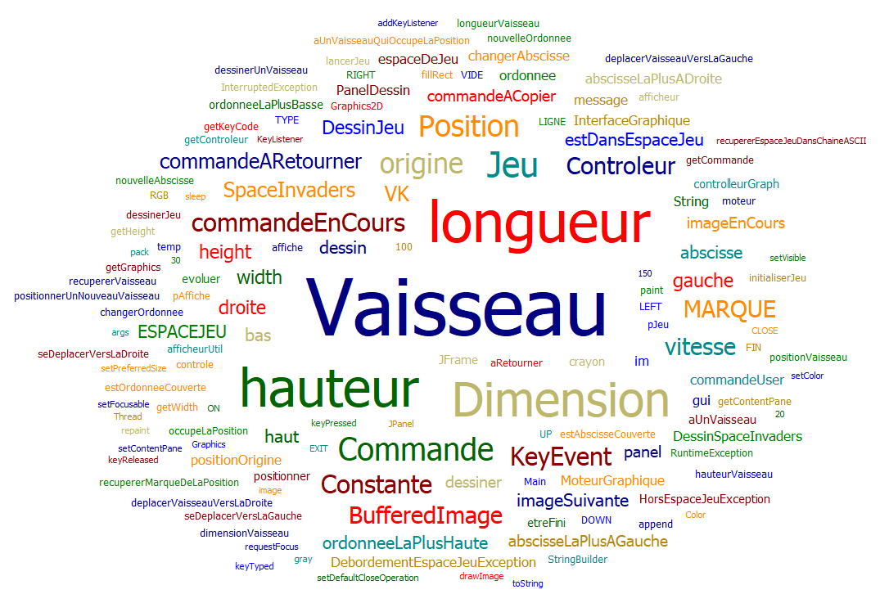
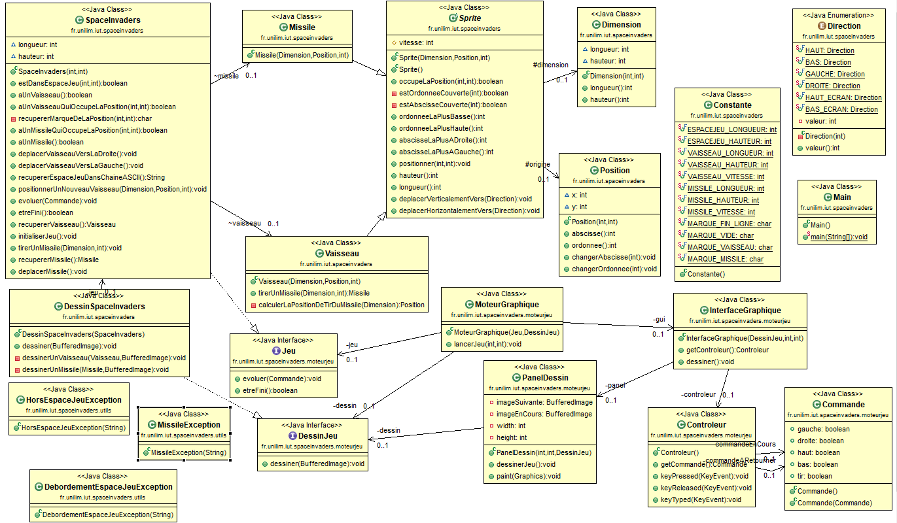
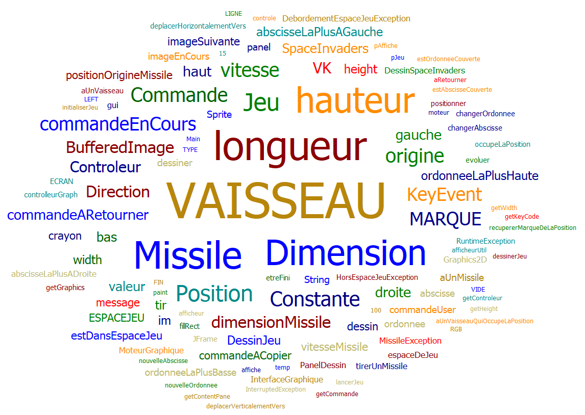
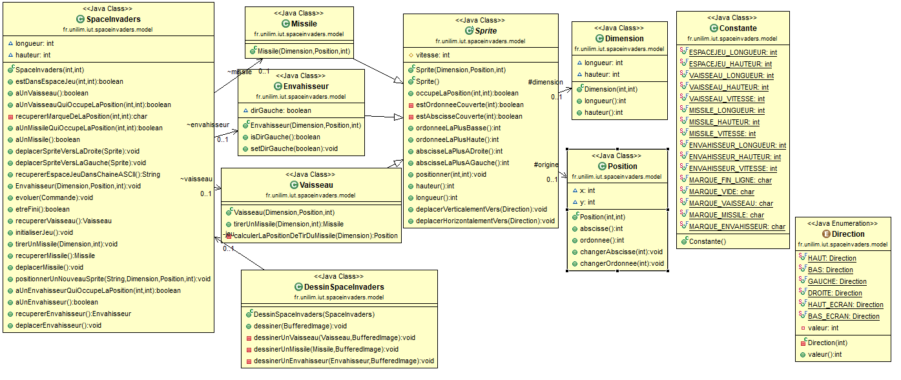
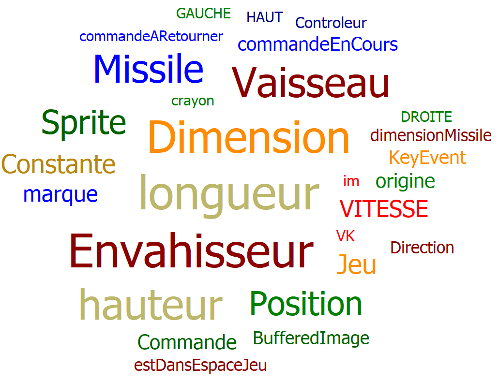

# spaceinvaders

- [Semaine n°1 : du 6 au 12 avril](#semaine1)  
- [Semaine n°2 : du 13 au 19 avril](#semaine2)  
- [Semaine n°3 : du 4 au 10 mai](#semaine3) 
- [Semaine n°4 : du 11 au 17 mai](#semaine4)
- [Semaine n°5 : du 18 au 24 mai](#semaine5)
- [Glossaire](#glossaire)

-------------

## Semaine n°1 : du 6 avril au 12 avril 

### Sprints et fonctionnalités réalisées 

#### Fonctionnalité n°1 : Déplacer un vaisseau dans l'espace de jeu (fini)

- Story n°1 : Créer un espace de jeu  
Un espace de jeu est créé aux dimensions données (2D) 
Cet espace de jeu est vide

-  Story n°2 : Positionner un nouveau vaisseau dans l’espace de jeu  
Un nouveau vaisseau est créé
Le vaisseau est positionné aux coordonnées transmises
Si un nouveau vaisseau essaye d’être positionné en dehors des limites de l’espace jeu, alors une exception devra être levée.
 Contraintes :
La position souhaitée est transmise par ses coordonnées x et y.
Le coin supérieur gauche de l’espace jeu (point en haut à gauche) a pour coordonnées (0,0)
La taille du vaisseau est réduite pour l'instant à son minimum (1 seul point)    

- Story n°3 : Déplacer le vaisseau vers la droite dans l'espace de jeu  
Le vaisseau se déplace d'un pas vers la droite 
Si le vaisseau se trouve sur la bordure droite de l'espace de jeu, le vaisseau doit rester immobile (aucun déplacement, aucune exception levée : le vaisseau reste juste à sa position actuelle).

- Story n°4 : Déplacer le vaisseau vers la gauche dans l'espace de jeu  
Le vaisseau se déplace d'un pas vers la gauche 
Si le vaisseau se trouve sur la bordure gauche de l'espace de jeu, le vaisseau doit rester immobile (aucun déplacement, aucune exception levée : le vaisseau reste juste à sa position actuelle).

### Fonctionnalité en cours d’implémentation : 
Aucune

### Diagramme de classes 

### Nuage de mots du projet spaceinvaders (séance n°1)  
 
(oublie du nuage de mots pour la fonctionnalité 1)

### Difficultés rencontrées
Aucune

### Remarques diverses
Aucune

-------------

## Semaine n°2 : du 13 avril au 19 avril 

### Sprints et fonctionnalités réalisées 

#### Fonctionnalité n°2 : Dimensionner le vaisseau (fini)

- Story n°1 : Pouvor dimensionner le vaisseau
Un vaisseau possédant une longueur et une hauteur données est créé.

- Story n°2 : Faire en sorte qu'il soit impossible de positionner un nouveau vaisseau qui déborde de l'espace de jeu
Un vaisseau précédemment créé est positionner dans l'espace de jeu aux coordonnées données. Si le vaisseau dépasse de l'espace de jeu alors une exception est levée. Contraintes : La position souhaitée est transmise par ses coordonnées x et y via une classe Dimension. Le coin supérieur gauche de l’espace jeu (point en haut à gauche) a pour coordonnées (0,0)

- Story n°3 : Déplacer un vaisseau vers la droite en tenant compte de sa dimension
Le vaisseau se déplace d'un pas vers la droite Si ce déplacement impliquerait que le vaisseau dépasse de l'espace de jeu, le vaisseau doit rester immobile (aucun déplacement, aucune exception levée : le vaisseau reste juste à sa position actuelle).

- Story n°4 : Déplacer un vaisseau vers la gauche en tenant compte de sa dimension
Le vaisseau se déplace d'un pas vers la gauche Si ce déplacement impliquerait que le vaisseau dépasse de l'espace de jeu, le vaisseau doit rester immobile (aucun déplacement, aucune exception levée : le vaisseau reste juste à sa position actuelle).

### Fonctionnalité en cours d’implémentation : 
Aucune

### Diagramme de classes 

### Nuage de mots du projet spaceinvaders (séance n°2) 

### Difficultés rencontrées
Aucune

### Remarques diverses
Aucune

-------------

## Semaine n°3 : du 4 mai au 10 mai 

### Sprints et fonctionnalités réalisées 

#### Fonctionnalité n°3 : Choisir la vitesse du vaisseau (fini)

- Story n°1 : Comprendre ce qu'est la vitesse dans notre application et faire un choix de conception
Ajout de la définition de la vitesse au glossaire.

- Story n°2 : Ajouter la vitesse au Vaisseau sans régression de comportement
Implémentation d'un attribut vitesse dans la classe Vaisseau. Refactoring des méthodes de la classe pour implémenter la vitesse.

- Story n°3 : Régler la vitesse du vaisseau
Création d'un nouveau constructeur en surcharge de la classe Vaisseau qui a la signature : Vaisseau(Dimension, Position, int).

- Story n°4 : Faire en sorte que le déplacement se fasse correctement pour une vitesse quelconque
Refactoring de la méthode positionnerUnNouveauVaisseau de la classe SpaceInvaders pour ajouter la vitesse à sa signature. refactoring de la classe SpaceInvadersTest pour inclure la vitesse dans tous les tests.

### Fonctionnalité en cours d’implémentation : 
Aucune

### Diagramme de classes 

### Nuage de mots du projet spaceinvaders (séance n°3) 

### Difficultés rencontrées
Aucune

### Remarques diverses
Aucune

-------------

## Semaine n°4 : du 11 mai au 17 mai 

### Sprints et fonctionnalités réalisées 

#### Fonctionnalité n°4 : Tirer un missile depuis le vaisseau (fini)

- Story n°1 : Définir ce qu'est un missile : création de la superclasse "Sprite" pour gérer le comportement du missile et du vaisseau

- Story n°2 : Tirer un missile
Lorsqu'on tire un missile, on crée et on positionne un nouveau missile devant le vaisseau, au centre de celui-ci. On s'assure que les dimensions du missile sont cohérente avec celles du vaisseau : pas plus grandes que lui.

- Story n°3 : Faire déplacer le missile à la verticale de manière autonome
Une fois tiré le missile doit se déplacer automatiquement vers le haut de l'écran à une vitesse donnée.

- Story n°4 : Le Missile doit disparaître du jeu lors qu'il atteint le haut de l'espace jeu
Une fois que le missile est au moins partiellement sorti de l'écran, il doit disparaitre afin de permettre d'en tirer un nouveau

### Fonctionnalité en cours d’implémentation : 
Aucune

### Diagramme de classes 

### Nuage de mots du projet spaceinvaders (séance n°4) 

### Difficultés rencontrées
Aucune

### Remarques diverses
Aucune

-------------

## Semaine n°5 : du 18 mai au 24 mai 

### Sprints et fonctionnalités réalisées 

#### Fonctionnalité n°5 : Ajouter un envahisseur dans le jeu (fini)

- Story n°1 : Créer un envahisseur.
Création de la classe Envahisseur qui hérite de la classe Sprite.

- Story n°2 : Positionner un nouvel envahisseur sur l'espace de jeu.
Un nouvel envahisseur est créé aux dimensions et a la position donnée.

- Story n°3 : Faire en sorte que l'envahisseur fasse des aller-retours entre la droite et la gauche.
Implémentation d'une nouvelle méthode void deplacerEnvahisseur() qui vérifie si l'envahisseur se trouve sur un bord ou pas et qui change sa direction si besoin.

### Fonctionnalité en cours d’implémentation : 
Aucune

### Diagramme de classes 

### Nuage de mots du projet spaceinvaders (séance n°5) 

### Difficultés rencontrées
Aucune

### Remarques diverses
Aucune

-------------

## Glossaire 

- Vaisseau : véhicule commandé par le joueur, pouvant se déplacer de droite à gauche et ayant la possibilité de lancer des missiles destinés à détruire le(s) envahisseurs. Il possède une Position et une Dimension.

- Envahisseur : ennemi qui apparaît à l'écran, se déplace automatiquement et qui doit être détruit par un missile lancé depuis le vaisseau du joueur.

- Missile : projectile envoyé à la verticale par le vaisseau vers l'envahisseur dans le but de le détruire.

- Dimension : caractéristique du vaisseau qui défini sa taille en 2D grâce à une longueur et une hauteur.

- Position : caractéristique du vaisseau qui défini sa position en 2D grâce à une abscisse et une ordonnée.

- Vitesse : Grandeur physique associée aux différents sprites. Elle correspond à la distance parcourue au cours d'un déplacement.

